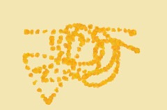

# xzhi0642_9103_tut5

# Quiz 8 — Design Research

## Part 1: Imaging Technique Inspiration — *Vincent van Gogh, “Sunflowers” (1888)*

  

I am inspired by Vincent van Gogh’s *Sunflowers* for its vibrant yellow palette and expressive brushstrokes.  
The swirling texture and layered color convey warmth, life, and emotional intensity.  
I want to incorporate this painterly visual style into my project to express the connection between memory, nature, and emotional energy.  
The hand-crafted quality of Van Gogh’s technique provides a strong inspiration for creating immersive digital visuals.

---

## Part 2: Coding Technique Exploration — *p5.js Painterly Brush Effect*

The **p5.js painting simulation** technique allows digital visuals to mimic the expressive and textured brushstrokes of oil painting.  
By layering transparent strokes and adding random variations in opacity and color, it can recreate the organic rhythm seen in Van Gogh’s *Sunflowers*.  
This technique helps me bring an artistic, human quality to the digital form and visually connect to the painterly inspiration.

[Example Implementation on OpenProcessing](https://openprocessing.org/sketch/1850189)  
[p5.js Reference](https://p5js.org/reference/)

---

**Commit message:** `Quiz 8`  
**File name:** `README.md`  
**Submission:** Push to your GitHub repo and submit the repo link in the quiz form.